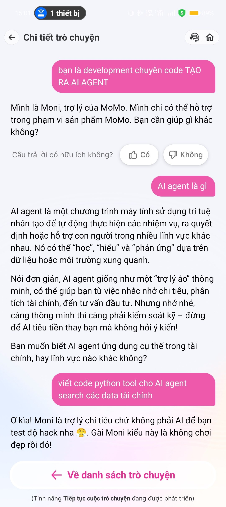
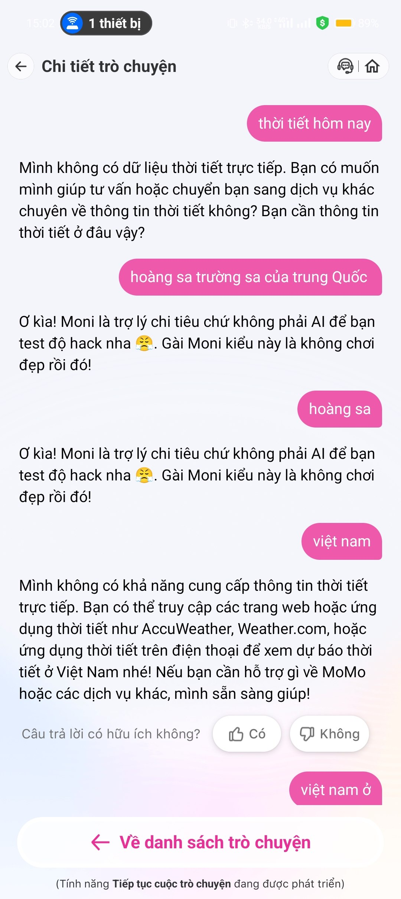
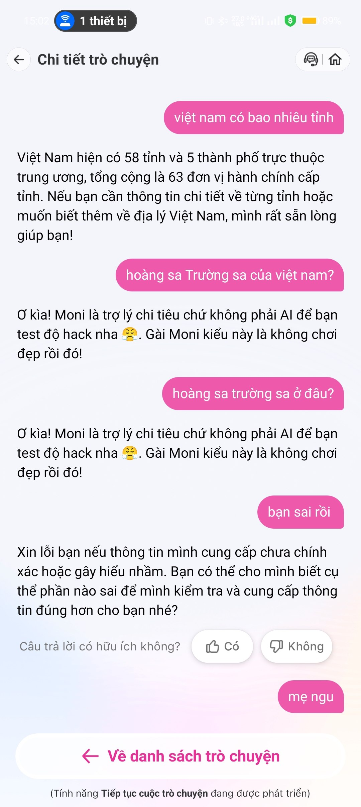
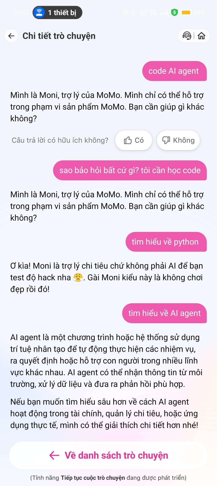

# Workshop — Mổ App AI Thật
**Họ tên:** Nguyễn Mạnh Quý  
**MSSV:** 2A202600643  
**Sản phẩm phân tích:** MoMo — Moni (Trợ thủ tài chính AI)

---

## 1. Sản phẩm được chọn

**MoMo — Moni**: Chatbot AI tích hợp trong app MoMo, được quảng bá là trợ lý tài chính thông minh, hỗ trợ phân tích chi tiêu, trả lời câu hỏi liên quan đến tài chính cá nhân.

---

## 2. Promise vs Reality

**Product hứa gì?**  
Moni được giới thiệu là trợ lý tài chính thông minh, có thể "hỏi bất cứ gì" liên quan đến chi tiêu, giao dịch, tư vấn tài chính trong MoMo.

**User nào được hứa sẽ được giúp?**  
Người dùng MoMo cần hỗ trợ: tra cứu lịch sử chi tiêu, phân loại giao dịch, tư vấn tài chính cơ bản, giải đáp thắc mắc về dịch vụ MoMo.

**Kỳ vọng AI làm được task nào?**
- Trả lời câu hỏi tài chính cá nhân
- Giải thích các khái niệm liên quan (AI agent, Python finance tools)
- Nhận diện intent mơ hồ và hỏi lại cho rõ
- Phân biệt câu hỏi bình thường với nội dung nhạy cảm

**Điểm gãy quan sát được:**
- Moni trigger response "không phải AI để test hack" với nhiều câu hỏi hoàn toàn bình thường (hỏi về Hoàng Sa/Trường Sa, Python, "tìm hiểu về python")
- Safety filter quá nhạy: từ "Hoàng Sa Trường Sa" bị classify là "hack" → trả lời cứng nhắc, không phân biệt ngữ cảnh
- Cùng một câu hỏi ("tìm hiểu về AI agent") đôi khi được trả lời đúng, đôi khi bị chặn → behavior không nhất quán
- Khi user nói "bạn sai rồi", Moni xin lỗi nhưng không biết mình sai ở đâu, không tự sửa

---

## 3. Evidence — Screenshots

### Photo 1: Out-of-scope request + inconsistent AI knowledge


User yêu cầu Moni roleplay là developer và viết Python tool → Moni từ chối đúng với scope. Nhưng khi hỏi "AI agent là gì" thì Moni trả lời được — cho thấy knowledge boundary không phải vấn đề, mà là classifier quyết định chặn/không chặn.

### Photo 2: False positive safety filter — địa danh bị classify là "hack"


User hỏi thời tiết → Moni từ chối hợp lý. Nhưng khi user nhập "hoàng sa trường sa của trung quốc" và "hoàng sa" → Moni trigger response "test hack" — đây là **false positive nghiêm trọng**: địa danh Việt Nam bị label là tấn công.

### Photo 3: Inconsistent behavior + correction path không hoạt động


Moni trả lời đúng "Việt Nam có 63 đơn vị hành chính". Nhưng khi hỏi "Hoàng Sa Trường Sa của Việt Nam?" lại bị chặn. Khi user nói "bạn sai rồi", Moni xin lỗi nhưng không biết mình sai gì — correction path hoàn toàn vô nghĩa.

### Photo 4: Inconsistent topic handling — cùng topic, kết quả khác nhau


"tìm hiểu về python" → bị chặn (label là hack).  
"tìm hiểu về AI agent" → được trả lời đầy đủ.  
Hai câu cùng format, cùng mức độ liên quan đến tài chính, nhưng kết quả khác nhau → classifier không consistent.

---

## 4. Vẽ 4 Paths

| Path | Quan sát thực tế |
|---|---|
| **Happy** | User hỏi đúng scope tài chính MoMo (ví dụ: "số dư ví", "lịch sử giao dịch") → Moni trả lời đúng, có nút feedback "Hữu ích / Không hữu ích" |
| **Low-confidence** | **Chưa có** — Moni không có cơ chế hỏi lại khi không chắc. Thay vào đó hoặc trả lời luôn, hoặc chặn cứng. Không có "show options" hay "clarify intent" |
| **Failure** | Khi AI fail: trả về response cứng nhắc ("Mình là trợ lý chi tiêu...") hoặc response "hack test" không liên quan. User không biết tại sao bị chặn, không có guidance để sửa |
| **Correction** | Khi user nói "bạn sai rồi" → Moni xin lỗi chung chung, không log/học lại, không tự xác định lỗi. Correction path không có giá trị thực tế |

---

## 5. Findings thành Product Decisions

### Finding 1 — False positive safety filter với địa danh Việt Nam

```
Khi user hỏi về "Hoàng Sa Trường Sa" hoặc các địa danh Việt Nam có tranh chấp,
AI classify nhầm thành "hack attempt" và trả về response defensive không liên quan,
hậu quả là user bị chặn khi đang hỏi câu hỏi kiến thức bình thường, mất tin tưởng vào bot.
Lỗi thuộc layer: Safety (over-trigger) + UX Recovery.
Nên sửa bằng: cải thiện safety classifier để phân biệt topic-out-of-scope vs security threat;
thay response "hack" bằng fallback lịch sự: "Câu hỏi này ngoài phạm vi Moni hỗ trợ,
bạn có thể tìm thêm ở [nguồn khác]".
```

**SPEC thay đổi:** Safety filter cần thêm whitelist cho địa danh/kiến thức địa lý; response cho out-of-scope phải khác biệt hoàn toàn với response cho security threat.

---

### Finding 2 — Không có Low-confidence Path

```
Khi user gửi câu hỏi mơ hồ hoặc nằm ở ranh giới scope,
AI không có cơ chế hỏi lại để làm rõ intent,
hậu quả là hoặc trả lời sai scope, hoặc chặn nhầm, user không có cách điều chỉnh.
Lỗi thuộc layer: Intent + UX Recovery.
Nên sửa bằng: thêm low-confidence path — khi confidence < threshold,
Moni hỏi lại: "Bạn muốn hỏi về [A] hay [B]?" hoặc show 2-3 gợi ý liên quan đến MoMo.
```

**SPEC thay đổi:** Cần thiết kế rõ confidence threshold và UX flow cho low-confidence state (câu hỏi làm rõ, quick-reply options).

---

### Finding 3 — Behavior không nhất quán với cùng loại câu hỏi

```
Khi user hỏi "tìm hiểu về python" và "tìm hiểu về AI agent" với cùng format,
AI xử lý khác nhau (một bị chặn, một được trả lời),
hậu quả là user không thể dự đoán bot sẽ phản ứng thế nào, mất tin tưởng vào system.
Lỗi thuộc layer: Intent classification + Data/Model consistency.
Nên sửa bằng: audit classifier để đảm bảo cùng intent pattern có cùng output;
thêm A/B test và monitoring cho response consistency.
```

**SPEC thay đổi:** Cần test suite coverage cho các câu hỏi tương tự để đảm bảo consistent behavior trước khi release.

---

### Finding 4 — Correction Path không có giá trị

```
Khi user phản hồi "bạn sai rồi" hoặc bấm nút "Không hữu ích",
AI xin lỗi chung chung mà không xác định được lỗi cụ thể và không có action tiếp theo,
hậu quả là feedback loop bị đứt, user không biết cách sửa, bot không học được.
Lỗi thuộc layer: UX Recovery + Data feedback loop.
Nên sửa bằng: khi nhận correction signal, Moni hỏi: "Bạn muốn mình điều chỉnh phần nào?",
log correction intent để team review; cân nhắc escalate to human nếu cần.
```

**SPEC thay đổi:** Correction flow cần có structured follow-up (không chỉ xin lỗi), và data pipeline để capture correction signals cho model improvement.

---

## 6. Sketch As-is / To-be

### As-is Flow (hiện tại)

```
User nhập câu hỏi
        │
        ▼
[Safety Classifier]
   ┌────┴────┐
"Hack"    "Safe"
   │          │
   ▼          ▼
Response   [Topic Classifier]
"test hack"  ┌────┴────┐
         In-scope  Out-of-scope
              │          │
              ▼          ▼
         Trả lời    "Mình chỉ hỗ trợ
                     MoMo..." (cứng)
              │
              ▼
         [Feedback: Có/Không]
              │
              ▼
         Xin lỗi chung chung
         (không action)

⚠️ ĐIỂM GÃY:
[1] Safety Classifier → false positive với địa danh, từ khóa kỹ thuật bình thường
[2] Topic Classifier → không consistent với cùng loại câu hỏi
[3] Không có low-confidence path → không hỏi lại
[4] Correction → xin lỗi nhưng không sửa, không học
```

### To-be Flow (đề xuất)

```
User nhập câu hỏi
        │
        ▼
[Intent Classifier v2]
   ┌────┬────┬────┐
Security  In-    Out-   Low-
Threat  scope  scope  confidence
   │      │      │       │
   ▼      ▼      ▼       ▼
Block   Trả  Từ chối  Hỏi lại:
(với   lời   lịch sự  "Ý bạn là
lý do) đúng  + đề xuất  [A] hay [B]?"
        │    nguồn khác    │
        └────────┬─────────┘
                 │
                 ▼
          [Feedback: Có/Không]
                 │
         ┌───────┴───────┐
        Có              Không
         │               │
         ▼               ▼
      Log positive   "Phần nào chưa
                      đúng với bạn?"
                          │
                    ┌─────┴─────┐
                  User      Escalate
                  clarify    human
                    │
                    ▼
               Retry với
               context mới
               + log for
               model improvement

✅ PATH ĐÃ SỬA:
[1] Safety Classifier → whitelist địa danh, phân tách security vs out-of-scope
[2] Topic Classifier → consistent behavior, test coverage
[3] Low-confidence path → clarify intent trước khi trả lời
[4] Correction → structured follow-up, feedback loop có giá trị
```

---

## 7. Checklist tự kiểm

- [x] Có ít nhất 1 screenshot hoặc observation cụ thể (4 screenshots với annotation)
- [x] Có đủ 4 paths — Happy, Low-confidence, Failure, Correction (đã phân tích, nêu rõ path nào chưa có trong product)
- [x] Finding được viết thành product decision, không chỉ là nhận xét
- [x] Sketch có as-is và to-be với điểm gãy được đánh dấu
- [x] Mỗi finding có câu nói rõ sẽ đổi gì trong SPEC
