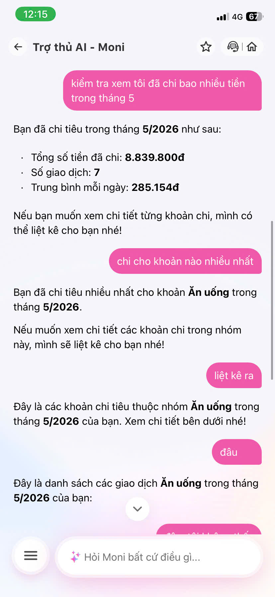
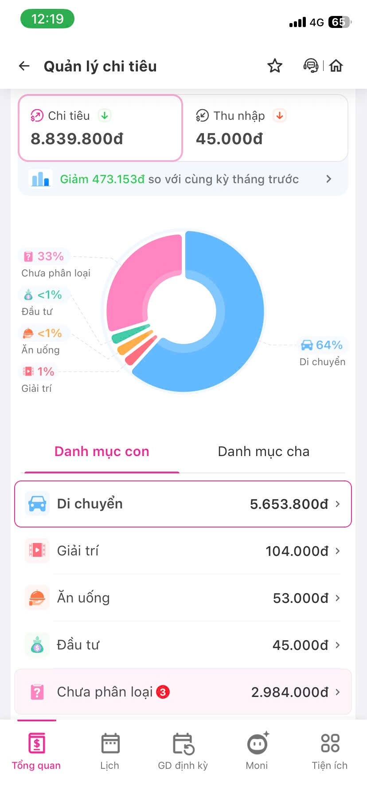
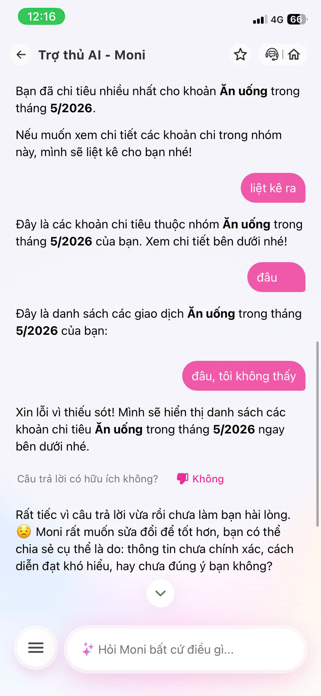

# Moni Audit - AI Agent Weakness Analysis

## App

Moni - MoMo Financial Assistant

## Goal

Evaluate Moni as an AI Agent by identifying user pain points in real usage flows and proposing improvements.

---

# Case 1 - Incorrect Financial Insight

## User Goal

The user wants to understand which spending category contributes the most to monthly expenses.

  
  

## As-Is Flow

### User

> Kiểm tra xem tôi đã chi bao nhiêu tiền trong tháng 5

### Moni

> Tổng số tiền đã chi: 8.839.800đ

This information matches the spending dashboard.

---

### User

> Chi cho khoản nào nhiều nhất?

### Moni

> Ăn uống

However, the spending dashboard shows:

| Category       | Amount     | Percentage |
| -------------- | ---------- | ---------- |
| Di chuyển      | 5.653.800đ | 64%        |
| Chưa phân loại | 2.984.000đ | 33%        |
| Giải trí       | 104.000đ   | 1%         |
| Ăn uống        | 53.000đ    | <1%        |

The answer is inconsistent with the underlying data.

---

## User Pain

The user loses trust in the assistant's analytical capability.

This is not merely a UI issue but a reasoning problem:

- Source data indicates one result.
- The AI generates a different conclusion.

Once users discover an incorrect insight, they are likely to question the reliability of all future recommendations.

---

## Root Cause Hypothesis

The assistant may not be grounding its response on the actual categorized spending data before generating the answer.

---

## To-Be Flow

### Moni

> Khoản chi lớn nhất của bạn trong tháng 5 là **Di chuyển (5.653.800đ - 64%)**.
>
> Các khoản tiếp theo:
>
> - Chưa phân loại: 2.984.000đ
> - Giải trí: 104.000đ
> - Ăn uống: 53.000đ

---

## Product Decision

Prioritize insight accuracy over conversational fluency.

A financial assistant can be brief, but it must never provide conclusions that contradict its own source data.

---

# Case 2 - Action Promised But Not Executed

## User Goal

  <text>The user wants to view all transactions belonging to the "Ăn uống" category.</text>
  

---

## As-Is Flow

### User

> Liệt kê các chi tiêu trong khoản ăn uống

### Moni

> Đây là các khoản chi tiêu thuộc nhóm Ăn uống trong tháng 5/2026 của bạn. Xem chi tiết bên dưới nhé!

No transaction list is displayed afterward.

---

## User Pain

The assistant confirms that it understands the request and implies that the data is available.

However:

- It promises an action.
- It does not complete the action.

This creates a broken experience where the user feels the assistant understands the task but fails to deliver the outcome.

---

## Root Cause Hypothesis

The assistant lacks a completion check before responding.

It generates a conversational acknowledgment without verifying that transaction data can actually be retrieved and rendered.

---

## To-Be Flow

### Success Case

> Các giao dịch thuộc nhóm Ăn uống trong tháng 5:
>
> - Highlands Coffee: 35.000đ
> - Circle K: 18.000đ

### Failure Case

> Mình chưa lấy được danh sách giao dịch lúc này.
>
> Bạn có thể thử lại hoặc xem trực tiếp trong mục Quản lý chi tiêu.

The assistant should never indicate that a result is available if it cannot actually provide it.

---

## Product Decision

Only confirm an action after validating that it can be completed.

If retrieval fails, communicate the limitation clearly instead of creating an expectation and abandoning the flow.

---

# Summary

## Weakness 1

**Hallucination on internal financial data**

The assistant generates insights that conflict with the actual spending records.

Impact:

- Loss of trust
- Incorrect financial recommendations
- Reduced adoption of AI-generated insights

---

## Weakness 2

**Failure to execute after acknowledging a request**

The assistant claims it will provide a result but never completes the task.

Impact:

- Broken user journey
- Increased frustration
- Reduced perception of agent capability

---

## Key Product Insight

The biggest gap observed is that Moni behaves more like a conversational chatbot than an execution-oriented financial agent.

Improving:

1. Data-grounded reasoning
2. Reliable task completion

would likely produce a significantly better user experience than adding more conversational features.